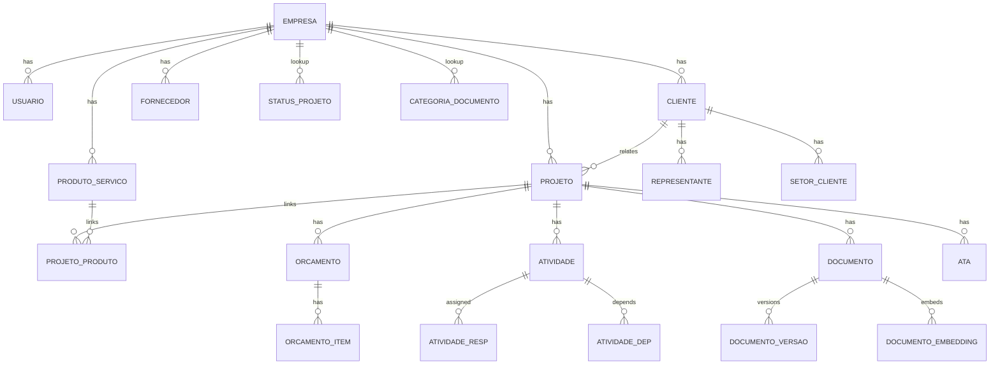
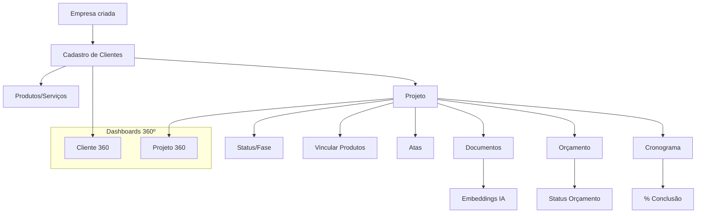

# 📦 ERP Interno Tech — Documento Consolidado v3 (para IA)

> **Formato**: Context Engineering 10/10 • Multi-tenant Cloud • Data Analysis Ready
> **Ordem de entrega**: (1) PRD Final → (2) Prisma Schema → (3) Flowcharts (Mermaid)
> **Objetivo**: documento único, pronto para uso por IDEs/IA (Cursor, Lovable, Trae).

---

# 1) PRD Final (PT)

## 1.1 Visão Geral

* **Sistema**: `ERPInternoTech`
* **Escopo**: multi-empresa, multi-cliente, multi-projeto
* **Objetivo**: gestão 360º da operação com dados unificados, rastreáveis e prontos para IA e automações.
* **Fora de escopo (MVP)**: faturamento fiscal/contábil, integrações de pagamentos, SSO corporativo (fase 2).

## 1.2 Resultados Esperados (Outcomes)

1. Decisões rápidas com painéis 360º para Cliente e Projeto.
2. Rastreabilidade completa de documentos, reuniões e alterações (auditoria).
3. Eficiência: criação de projeto com artefatos básicos (documentos/cronograma/orçamento) em ≤15 min.
4. Base IA: classificação automática de documentos e busca semântica.

## 1.3 Perfis de Usuário (MVP → Futuro)

* MVP: `Administrador` (acesso total).
* Futuro: `Vendedor`, `Gerente`, `ClienteExterno`.

## 1.4 Requisitos Funcionais por Módulo

### 1.4.1 Empresa

* **Obrigatórios**: `razaoSocial`, `nomeFantasia`, `cnpj`, `endereco`.
* **Funcionalidades**: CRUD; catálogo de produtos/serviços; usuários internos.
* **KPIs**: nº de projetos ativos; distribuição de produtos/serviços.

### 1.4.2 Cliente

* **Cadastro**: integração Receita Federal + fallback manual.
* **Obrigatórios**: `razaoSocial`, `cnpj`.
* **Opcionais**: `segmento`, `representantes[]`, `setores[]`.
* **Funcionalidades**: contatos; setores (coordenador, gerente, key user); documentos categorizados e versionados.
* **Painel 360**: nº de projetos ativos; total de documentos; último contato.

### 1.4.3 Projeto

* **Obrigatórios**: `clienteId`, `assunto`, `dataEntrada`.
* **Opcionais**: `statusId`, `expectativa`, `objetivo`, `observacoes`.
* **Funcionalidades**: status (lookup `StatusProjeto` com campo `fase`), datas principais; responsáveis; stakeholders; vínculo a produtos/serviços; documentos; orçamento; cronograma; reuniões/atas versionadas.
* **Painel 360**: % concluído; status orçamento; nº atas.

### 1.4.4 Documentos

* **Upload**: ≤50MB; formatos: PDF, DOCX, XLSX, PNG, JPG.
* **Versionamento**: `Documento` (metadados) + `DocumentoVersao` (conteúdo imutável).
* **Rollback**: reversão permitida.
* **IA**: embeddings para busca semântica.

### 1.4.5 Orçamento

* **Estrutura**: `Orcamento` + `OrcamentoItem[]`.
* **Cálculos**: `subtotal = quantidade * precoUnitario`; `valorTotal = SUM(subtotal)`; `moeda` default BRL.
* **Status**: `ABERTO` → `APROVADO`/`REJEITADO`.
* **KPIs**: orçamentos por status; histórico.

### 1.4.6 Cronograma

* **Atividades**: `titulo`, `dataInicio`, `dataFim`, `responsaveis[]`, `dependencias[]`.
* **% Conclusão**: `tarefasConcluidas / tarefasTotais`.
* **Integrações**: atas/reuniões; alertas de atraso.

### 1.4.7 Atas/Reuniões

* **Versão** por projeto; `rollback` permitido.
* **Relacionamento**: decisões/tarefas vinculadas.

## 1.5 NFR

* Segurança: RLS; papéis; criptografia em repouso e trânsito.
* Performance: ≤100 registros <2s; paginação 20; p95<500ms em 100k/tenant.
* Confiabilidade: backup diário; RPO≤24h; RTO≤4h.
* Acessibilidade: WCAG AA; teclado; ARIA.
* Observabilidade: logs multi-tenant; métricas p95/erro/taxa.

## 1.6 Dados & Seeds

* Tenant key: `empresaId`.
* Auditoria: `createdAt`, `updatedAt`, `createdById`, `updatedById`.
* Lookups: `StatusProjeto`, `CategoriaDocumento`.
* Enum: `OrcamentoStatus`.

## 1.7 Critérios de Aceite

* CRUD completo; RLS ativo; soft delete.
* Documentos/atas versionados com rollback.
* Orçamento com totais corretos.
* Cronograma com múltiplos responsáveis/dependências válidas.
* KPIs 360 entregues.
* Performance e A11y conforme NFR.
* Embeddings gerados por documento.

---

# 1.8 PRD — English (concise)

Scope: multi-tenant, multi-client, multi-project.
Must haves: dashboards, docs with versioning+rollback, budgets with totals, schedules with dependencies, meetings versions.
NFR: RLS, Decimal money, p95<500ms, uploads ≤50MB, WCAG AA, observability.
Data: tenant key `empresaId`, audit fields, seeds for lookups, embeddings for semantic search.

---

# 2) Prisma Schema (Completo)

```prisma
// ===========================
// Datasource & Generator
// ===========================
datasource db {
  provider = "postgresql"
  url      = env("DATABASE_URL")
}

generator client {
  provider = "prisma-client-js"
}

// ===========================
// Enums (estáveis)
// ===========================
enum OrcamentoStatus {
  ABERTO
  APROVADO
  REJEITADO
}

// ===========================
// Modelos Centrais
// ===========================
model Empresa {
  id            String            @id @default(uuid())
  razaoSocial   String
  nomeFantasia  String
  cnpj          String            @unique
  endereco      String

  // Relacionamentos
  produtos      ProdutoServico[]
  usuarios      Usuario[]
  clientes      Cliente[]
  projetos      Projeto[]
  fornecedores  Fornecedor[]

  createdAt     DateTime          @default(now())
  updatedAt     DateTime          @updatedAt
  deletedAt     DateTime?
  deletedById   String?

  @@index([cnpj])
}

model Usuario {
  id            String     @id @default(uuid())
  empresaId     String?
  empresa       Empresa?   @relation(fields: [empresaId], references: [id], onDelete: SetNull)

  nome          String
  email         String     @unique
  senhaHash     String
  role          String     // administrador | vendedor | gerente | clienteExterno

  createdAt     DateTime   @default(now())
  updatedAt     DateTime   @updatedAt
  deletedAt     DateTime?
  deletedById   String?

  @@index([empresaId, role])
}

model Cliente {
  id               String          @id @default(uuid())
  empresaId        String
  empresa          Empresa         @relation(fields: [empresaId], references: [id], onDelete: Cascade)

  razaoSocial      String
  cnpj             String
  normalizedCnpj   String
  segmento         String?

  representantes   Representante[]
  setores          SetorCliente[]
  documentos       Documento[]
  projetos         Projeto[]

  createdAt        DateTime        @default(now())
  updatedAt        DateTime        @updatedAt
  deletedAt        DateTime?
  deletedById      String?

  @@unique([empresaId, cnpj])
  @@index([empresaId, normalizedCnpj])
  @@index([empresaId, createdAt])
}

model SetorCliente {
  id            String   @id @default(uuid())
  clienteId     String
  cliente       Cliente  @relation(fields: [clienteId], references: [id], onDelete: Cascade)
  nome          String

  coordenadorId String?
  gerenteId     String?
  keyUserId     String?

  coordenador   Usuario? @relation("SetorCoordenador", fields: [coordenadorId], references: [id])
  gerente       Usuario? @relation("SetorGerente",     fields: [gerenteId],     references: [id])
  keyUser       Usuario? @relation("SetorKeyUser",     fields: [keyUserId],     references: [id])

  @@index([clienteId, nome])
}

model Representante {
  id         String   @id @default(uuid())
  clienteId  String
  cliente    Cliente  @relation(fields: [clienteId], references: [id], onDelete: Cascade)

  nome       String
  email      String?
  telefone   String?

  @@index([clienteId, nome])
}

model ProdutoServico {
  id         String    @id @default(uuid())
  empresaId  String
  empresa    Empresa   @relation(fields: [empresaId], references: [id], onDelete: Cascade)

  nome       String
  tipo       String    // produto | servico
  categoria  String
  status     String

  projetos   ProjetoProduto[]

  createdAt  DateTime  @default(now())
  updatedAt  DateTime  @updatedAt
  deletedAt  DateTime?
  deletedById String?

  @@unique([empresaId, nome, tipo])
  @@index([empresaId, categoria])
  @@index([empresaId, status])
}

model Projeto {
  id            String           @id @default(uuid())
  empresaId     String
  empresa       Empresa          @relation(fields: [empresaId], references: [id], onDelete: Cascade)

  clienteId     String
  cliente       Cliente          @relation(fields: [clienteId], references: [id], onDelete: Restrict)

  assunto       String
  statusId      String?
  status        StatusProjeto?   @relation(fields: [statusId], references: [id])
  dataEntrada   DateTime

  expectativa   String?
  objetivo      String?
  observacoes   String?

  gerenteId     String?
  vendedorId    String?
  gerente       Usuario?         @relation("GerenteProjeto",  fields: [gerenteId],  references: [id])
  vendedor      Usuario?         @relation("VendedorProjeto", fields: [vendedorId], references: [id])

  produtos      ProjetoProduto[]
  documentos    Documento[]
  orcamentos    Orcamento[]
  atividades    Atividade[]
  atas          Ata[]

  createdAt     DateTime         @default(now())
  updatedAt     DateTime         @updatedAt
  deletedAt     DateTime?
  deletedById   String?

  @@index([empresaId, clienteId])
  @@index([empresaId, statusId])
  @@index([empresaId, dataEntrada])
  @@unique([empresaId, assunto, clienteId])
}

model ProjetoProduto {
  id           String          @id @default(uuid())
  empresaId    String
  projetoId    String
  produtoId    String

  projeto      Projeto         @relation(fields: [projetoId], references: [id], onDelete: Cascade)
  produto      ProdutoServico  @relation(fields: [produtoId], references: [id], onDelete: Cascade)

  @@index([empresaId, projetoId])
  @@unique([projetoId, produtoId])
}

model Fornecedor {
  id          String     @id @default(uuid())
  empresaId   String
  empresa     Empresa    @relation(fields: [empresaId], references: [id], onDelete: Cascade)

  nome        String
  cnpj        String?
  email       String?
  telefone    String?

  orcamentos  Orcamento[]
  itens       OrcamentoItem[]

  @@unique([empresaId, nome])
  @@index([empresaId, cnpj])
}

model Orcamento {
  id            String          @id @default(uuid())
  empresaId     String
  projetoId     String
  projeto       Projeto         @relation(fields: [projetoId], references: [id], onDelete: Cascade)

  status        OrcamentoStatus @default(ABERTO)
  moeda         String          @default("BRL")
  valorTotal    Decimal         @db.Decimal(18, 2) @default(0)

  fornecedorId  String?
  fornecedor    Fornecedor?     @relation(fields: [fornecedorId], references: [id])

  itens         OrcamentoItem[]

  createdAt     DateTime        @default(now())
  updatedAt     DateTime        @updatedAt
  deletedAt     DateTime?
  deletedById   String?

  createdById   String?
  updatedById   String?
  createdBy     Usuario?        @relation("OrcamentoCreatedBy", fields: [createdById], references: [id])
  updatedBy     Usuario?        @relation("OrcamentoUpdatedBy", fields: [updatedById], references: [id])

  @@index([empresaId, projetoId])
  @@index([empresaId, status])
  @@index([empresaId, createdAt])
}

model OrcamentoItem {
  id            String   @id @default(uuid())
  empresaId     String
  orcamentoId   String
  orcamento     Orcamento @relation(fields: [orcamentoId], references: [id], onDelete: Cascade)

  descricao     String
  quantidade    Int
  precoUnitario Decimal   @db.Decimal(18, 2)
  subtotal      Decimal   @db.Decimal(18, 2)

  fornecedorId  String?
  fornecedor    Fornecedor? @relation(fields: [fornecedorId], references: [id])

  @@index([empresaId, orcamentoId])
}

model Atividade {
  id            String           @id @default(uuid())
  empresaId     String
  projetoId     String
  projeto       Projeto          @relation(fields: [projetoId], references: [id], onDelete: Cascade)

  titulo        String
  descricao     String?
  dataInicio    DateTime
  dataFim       DateTime
  concluida     Boolean          @default(false)

  responsaveis  AtividadeResponsavel[]
  dependencias  AtividadeDependencia[]  @relation("Dependencias")
  dependenteDe  AtividadeDependencia[]  @relation("DependenciasReverse")

  createdAt     DateTime         @default(now())
  updatedAt     DateTime         @updatedAt
  deletedAt     DateTime?
  deletedById   String?

  @@index([empresaId, projetoId])
  @@index([empresaId, concluida])
  @@index([empresaId, dataFim])
}

model AtividadeResponsavel {
  id            String    @id @default(uuid())
  empresaId     String
  atividadeId   String
  usuarioId     String

  papel         String?   // executor | aprovador
  alocadoEm     DateTime  @default(now())

  atividade     Atividade @relation(fields: [atividadeId], references: [id], onDelete: Cascade)
  usuario       Usuario   @relation(fields: [usuarioId], references: [id], onDelete: Cascade)

  @@unique([atividadeId, usuarioId])
  @@index([empresaId, atividadeId])
}

model AtividadeDependencia {
  id                   String    @id @default(uuid())
  empresaId            String
  atividadeId          String
  dependeDaAtividadeId String

  atividade            Atividade @relation("Dependencias",        fields: [atividadeId],          references: [id], onDelete: Cascade)
  dependeDaAtividade   Atividade @relation("DependenciasReverse", fields: [dependeDaAtividadeId], references: [id], onDelete: Cascade)

  tipo                 String?   // FS | SS | FF | SF

  @@unique([atividadeId, dependeDaAtividadeId])
  @@index([empresaId, atividadeId])
}

model Ata {
  id            String     @id @default(uuid())
  empresaId     String
  projetoId     String
  projeto       Projeto    @relation(fields: [projetoId], references: [id], onDelete: Cascade)

  conteudo      String
  versao        Int        @default(1)
  rollback      Boolean    @default(false)

  createdAt     DateTime   @default(now())
  updatedAt     DateTime   @updatedAt
  deletedAt     DateTime?
  deletedById   String?

  createdById   String?
  updatedById   String?
  createdBy     Usuario?   @relation("AtaCreatedBy", fields: [createdById], references: [id])
  updatedBy     Usuario?   @relation("AtaUpdatedBy", fields: [updatedById], references: [id])

  @@index([empresaId, projetoId])
  @@unique([projetoId, versao])
}

// ===========================
// Documentos (versionamento + IA)
// ===========================
model Documento {
  id              String            @id @default(uuid())
  empresaId       String
  projetoId       String?
  clienteId       String?

  categoriaId     String?
  categoria       CategoriaDocumento? @relation(fields: [categoriaId], references: [id], onDelete: SetNull)

  titulo          String
  currentVersion  Int               @default(1)

  // Metadados de armazenamento
  storageKey      String
  bucket          String?
  contentType     String
  sizeBytes       Int
  checksum        String?
  storageProvider String?           // s3 | gcs | r2

  createdAt       DateTime          @default(now())
  updatedAt       DateTime          @updatedAt
  deletedAt       DateTime?
  deletedById     String?

  createdById     String?
  updatedById     String?
  createdBy       Usuario?          @relation("DocumentoCreatedBy", fields: [createdById], references: [id])
  updatedBy       Usuario?          @relation("DocumentoUpdatedBy", fields: [updatedById], references: [id])

  projeto         Projeto?          @relation(fields: [projetoId], references: [id], onDelete: SetNull)
  cliente         Cliente?          @relation(fields: [clienteId], references: [id], onDelete: SetNull)

  versoes         DocumentoVersao[]
  embeddings      DocumentoEmbedding[]

  @@index([empresaId, projetoId])
  @@index([empresaId, clienteId])
  @@index([empresaId, categoriaId])
  @@index([empresaId, updatedAt])
  @@unique([empresaId, storageKey])
}

model DocumentoVersao {
  id            String    @id @default(uuid())
  documentoId   String
  numero        Int
  rollback      Boolean   @default(false)

  storageKey    String
  contentType   String
  sizeBytes     Int
  checksum      String?

  createdAt     DateTime  @default(now())
  createdById   String?
  createdBy     Usuario?  @relation(fields: [createdById], references: [id])

  documento     Documento @relation(fields: [documentoId], references: [id], onDelete: Cascade)

  @@unique([documentoId, numero])
  @@index([documentoId, createdAt])
}

// Requer extensão pgvector e índice vetorial (migration SQL)
model DocumentoEmbedding {
  id            String   @id @default(uuid())
  documentoId   String
  versaoId      String?
  embedding     Unsupported("vector(1536)")
  provider      String?
  dims          Int      @default(1536)

  documento     Documento        @relation(fields: [documentoId], references: [id], onDelete: Cascade)
  versao        DocumentoVersao? @relation(fields: [versaoId], references: [id], onDelete: SetNull)

  @@index([documentoId])
}

// ===========================
// Lookups (seeds via UI)
// ===========================
model StatusProjeto {
  id          String   @id @default(uuid())
  empresaId   String
  nome        String
  fase        String?

  projetos    Projeto[]

  @@unique([empresaId, nome])
  @@index([empresaId, fase])
}

model CategoriaDocumento {
  id          String   @id @default(uuid())
  empresaId   String
  nome        String

  documentos  Documento[]

  @@unique([empresaId, nome])
  @@index([empresaId])
}
```

---

# 3) Flowcharts (Mermaid)

## 3.1 ERD



## 3.2 Fluxo Operacional



## 3.3 Fluxo Documentos

```mermaid
graph TD
  U[Upload Documento] --> V{Valida tipo/tamanho}
  V -- ok --> W[Cria Documento (v1)]
  W --> X[Cria DocumentoVersao (n=1)]
  X --> Y[Nova versão]
  Y --> Z[Rollback versão alvo]
  Z --> W
  V -- inválido --> ERR[Erro]
```

---

# 4) Notas de Context Engineering

* Estrutura sequencial e numerada.
* Campos obrigatórios vs opcionais claros.
* Critérios com IDs (CA-XXX).
* Seeds em CSV.
* Nomenclatura camelCase.
* Diagramas Mermaid incluídos.
* Documento bilíngue (PT/EN).
