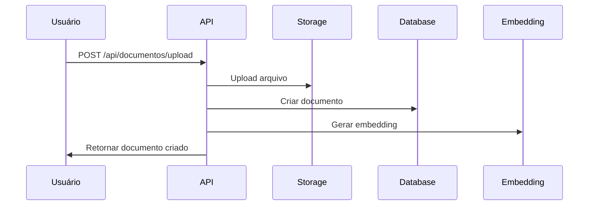
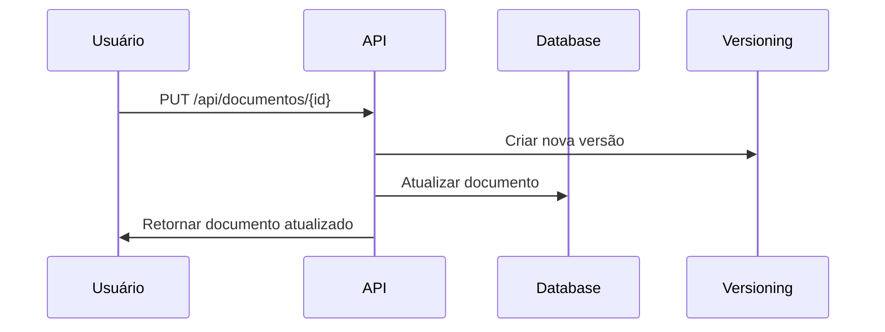
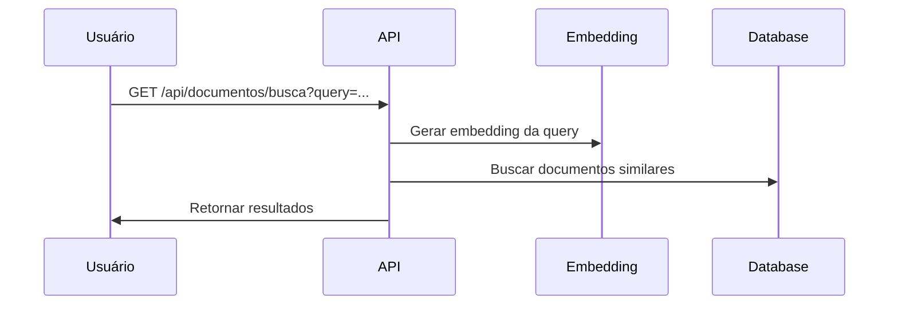

# 📄 Domínio: Documentos

## Visão Geral

O domínio de Documentos gerencia todo o ciclo de vida dos documentos, incluindo versionamento, busca semântica e controle de acesso.

## Modelo de Dados

### **Schema Prisma**
```prisma
model Documento {
  id          String   @id @default(cuid())
  nome        String
  descricao   String?
  versao      Int      @default(1)
  conteudo    String?  // Para documentos de texto
  arquivoUrl  String?  // Para arquivos binários
  tipo        TipoDocumento
  categoriaId String?
  projetoId   String
  empresaId   String
  
  // Relacionamentos
  categoria   CategoriaDocumento? @relation(fields: [categoriaId], references: [id])
  projeto     Projeto             @relation(fields: [projetoId], references: [id])
  versoes     DocumentoVersao[]
  embeddings  Embedding[]
  
  // Auditoria
  createdAt   DateTime @default(now())
  updatedAt   DateTime @updatedAt
  createdBy   String?
  updatedBy   String?
  
  @@map("documentos")
}

model DocumentoVersao {
  id          String   @id @default(cuid())
  documentoId String
  versao      Int
  conteudo    String?
  arquivoUrl  String?
  hash        String   // Para verificação de integridade
  
  // Relacionamentos
  documento   Documento @relation(fields: [documentoId], references: [id])
  
  // Auditoria
  createdAt   DateTime @default(now())
  createdBy   String?
  
  @@unique([documentoId, versao])
  @@map("documento_versoes")
}

model Embedding {
  id          String   @id @default(cuid())
  documentoId String
  conteudo    String   // Texto usado para gerar embedding
  embedding   Float[]  // Array de embeddings
  modelo      String   @default("text-embedding-ada-002")
  
  // Relacionamentos
  documento   Documento @relation(fields: [documentoId], references: [id])
  
  // Auditoria
  createdAt   DateTime @default(now())
  
  @@map("embeddings")
}

enum TipoDocumento {
  TEXTO
  PDF
  IMAGEM
  PLANILHA
  APRESENTACAO
  OUTRO
}
```

## Regras de Negócio

### **1. Versionamento**
- ✅ **Automático**: Nova versão a cada alteração
- ✅ **Imutável**: Versões antigas não podem ser modificadas
- ✅ **Hash**: Verificação de integridade obrigatória
- ✅ **Histórico**: Manutenção completa do histórico

### **2. Tipos de Documento**
- ✅ **TEXTO**: Documentos de texto simples
- ✅ **PDF**: Documentos PDF
- ✅ **IMAGEM**: Imagens (PNG, JPG, etc.)
- ✅ **PLANILHA**: Arquivos Excel, CSV
- ✅ **APRESENTACAO**: PowerPoint, etc.
- ✅ **OUTRO**: Outros tipos de arquivo

### **3. Categorização**
- ✅ **Obrigatória**: Todo documento deve ter categoria
- ✅ **Hierárquica**: Categorias podem ter subcategorias
- ✅ **Padronizada**: Categorias pré-definidas por empresa

### **4. Controle de Acesso**
- ✅ **Herança**: Documentos herdam permissões do projeto
- ✅ **Granular**: Permissões por usuário/role
- ✅ **Auditoria**: Log de todos os acessos

## APIs

### **Endpoints**
```
GET    /api/documentos                    # Listar documentos
POST   /api/documentos                    # Criar documento
GET    /api/documentos/{id}               # Obter documento
PUT    /api/documentos/{id}               # Atualizar documento
DELETE /api/documentos/{id}               # Deletar documento
GET    /api/documentos/{id}/versoes       # Listar versões
GET    /api/documentos/{id}/versoes/{v}   # Obter versão específica
POST   /api/documentos/{id}/upload        # Upload de arquivo
GET    /api/documentos/busca              # Busca semântica
```

### **Filtros**
- `projetoId`: Filtrar por projeto
- `categoriaId`: Filtrar por categoria
- `tipo`: Filtrar por tipo
- `versao`: Filtrar por versão
- `dataInicio`: Filtrar por data de criação
- `dataFim`: Filtrar por data de criação

### **Busca Semântica**
- `query`: Texto para busca semântica
- `limite`: Número máximo de resultados
- `relevancia`: Filtro por relevância mínima
- `projetoId`: Buscar apenas em projeto específico

## Fluxos de Trabalho

### **1. Upload de Documento**


### **2. Versionamento Automático**


### **3. Busca Semântica**


## Relacionamentos

### **1. Projeto**
- Documento pertence a um projeto
- Herda permissões do projeto
- Pode ser acessado por membros do projeto

### **2. Categoria**
- Documento tem uma categoria
- Categoria define regras de acesso
- Categoria pode ter subcategorias

### **3. Versões**
- Documento tem múltiplas versões
- Versões são imutáveis
- Histórico completo de mudanças

### **4. Embeddings**
- Documento pode ter múltiplos embeddings
- Embeddings para busca semântica
- Modelos de IA configuráveis

## Permissões

### **Por Role**
- **ADMIN**: Acesso total a todos os documentos
- **GERENTE**: Acesso a documentos da empresa
- **USUARIO**: Acesso a documentos dos projetos
- **CLIENTE_EXTERNO**: Acesso apenas aos seus documentos

### **Por Tipo**
- **PÚBLICO**: Acesso para todos os usuários
- **INTERNO**: Acesso apenas para usuários internos
- **CONFIDENCIAL**: Acesso restrito
- **SECRETO**: Acesso muito restrito

## Integrações

### **1. Supabase Storage**
- Upload de arquivos
- Geração de URLs assinadas
- Controle de acesso

### **2. OpenAI Embeddings**
- Geração de embeddings
- Busca semântica
- Clustering de documentos

### **3. Notificações**
- Upload de novos documentos
- Mudanças de versão
- Acessos suspeitos

## Agentes IA

### **Agente de Documentação**
- Organiza e categoriza documentos
- Sugere tags e metadados
- Detecta duplicatas

### **Agente de Busca**
- Busca semântica em documentos
- Sugestões de conteúdo relacionado
- Otimização de resultados

### **Agente Auditor**
- Verifica consistência de documentos
- Valida integridade de versões
- Detecta documentos órfãos

## Métricas e KPIs

### **Métricas de Documentos**
- Total de documentos por projeto
- Tamanho médio de documentos
- Taxa de versionamento
- Tempo de upload

### **Métricas de Busca**
- Queries por dia
- Taxa de sucesso da busca
- Tempo de resposta
- Satisfação do usuário

### **Métricas de Armazenamento**
- Espaço utilizado
- Crescimento mensal
- Tipos de arquivo mais comuns
- Documentos órfãos

## Testes

### **Testes Unitários**
- Validação de campos
- Regras de versionamento
- Cálculo de hash

### **Testes de Integração**
- Upload de arquivos
- Geração de embeddings
- Busca semântica

### **Testes de Performance**
- Upload de arquivos grandes
- Busca em muitos documentos
- Geração de embeddings

## Monitoramento

### **Logs**
- Upload de documentos
- Acessos a documentos
- Mudanças de versão
- Buscas realizadas

### **Métricas**
- Documentos criados por dia
- Espaço utilizado
- Queries de busca
- Tempo de resposta

### **Alertas**
- Espaço de armazenamento cheio
- Uploads falhando
- Buscas lentas
- Documentos órfãos
