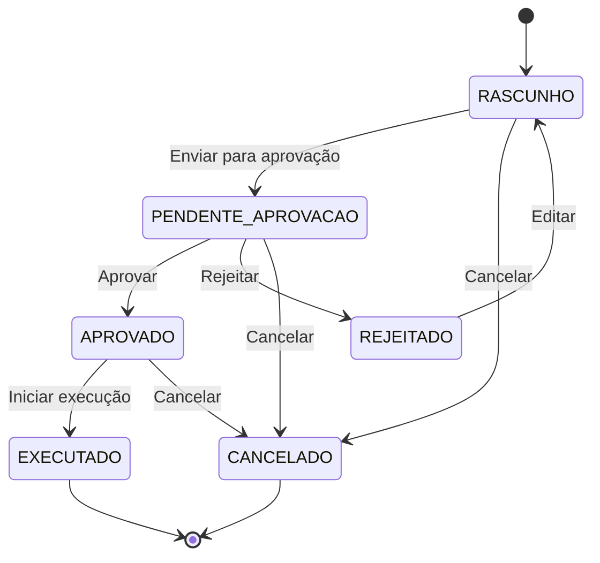
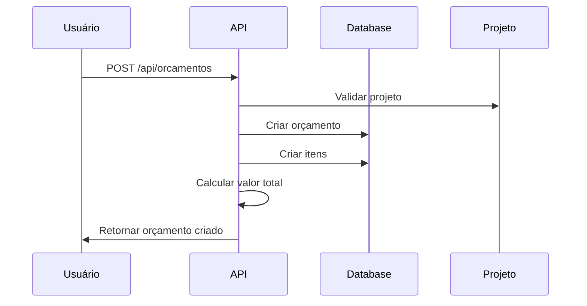
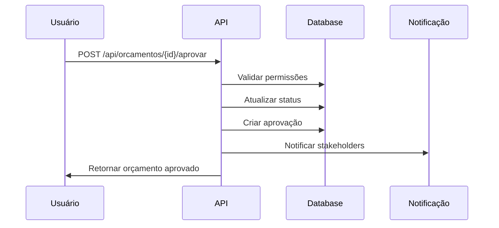
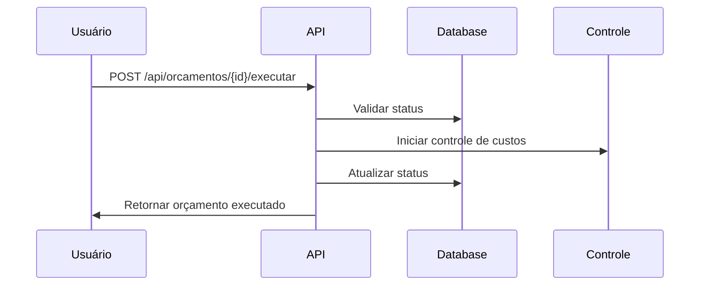

# 💰 Domínio: Orçamento

## Visão Geral

O domínio de Orçamento gerencia todo o ciclo financeiro dos projetos, desde a criação até a execução e controle de custos.

## Modelo de Dados

### **Schema Prisma**
```prisma
model Orcamento {
  id          String   @id @default(cuid())
  nome        String
  descricao   String?
  valor       Decimal
  moeda       String   @default("BRL")
  status      StatusOrcamento
  projetoId   String
  empresaId   String
  
  // Relacionamentos
  projeto     Projeto           @relation(fields: [projetoId], references: [id])
  itens       OrcamentoItem[]
  aprovacoes  AprovacaoOrcamento[]
  
  // Auditoria
  createdAt   DateTime @default(now())
  updatedAt   DateTime @updatedAt
  createdBy   String?
  updatedBy   String?
  
  @@map("orcamentos")
}

model OrcamentoItem {
  id          String   @id @default(cuid())
  orcamentoId String
  descricao   String
  quantidade  Decimal
  valorUnitario Decimal
  valorTotal  Decimal  // Calculado automaticamente
  categoriaId String?
  
  // Relacionamentos
  orcamento   Orcamento         @relation(fields: [orcamentoId], references: [id])
  categoria   CategoriaItem?    @relation(fields: [categoriaId], references: [id])
  
  // Auditoria
  createdAt   DateTime @default(now())
  updatedAt   DateTime @updatedAt
  createdBy   String?
  updatedBy   String?
  
  @@map("orcamento_itens")
}

model AprovacaoOrcamento {
  id          String   @id @default(cuid())
  orcamentoId String
  aprovadorId String
  status      StatusAprovacao
  comentarios String?
  
  // Relacionamentos
  orcamento   Orcamento @relation(fields: [orcamentoId], references: [id])
  aprovador   Usuario   @relation(fields: [aprovadorId], references: [id])
  
  // Auditoria
  createdAt   DateTime @default(now())
  
  @@map("aprovacoes_orcamento")
}

enum StatusOrcamento {
  RASCUNHO
  PENDENTE_APROVACAO
  APROVADO
  REJEITADO
  EXECUTADO
  CANCELADO
}

enum StatusAprovacao {
  PENDENTE
  APROVADO
  REJEITADO
}
```

## Regras de Negócio

### **1. Criação de Orçamentos**
- ✅ Apenas usuários da empresa podem criar
- ✅ Projeto deve existir e estar ativo
- ✅ Valor deve ser positivo
- ✅ Moeda deve ser válida

### **2. Status de Orçamentos**
- ✅ **RASCUNHO**: Orçamento em criação, pode ser editado
- ✅ **PENDENTE_APROVACAO**: Aguardando aprovação
- ✅ **APROVADO**: Orçamento aprovado, pode ser executado
- ✅ **REJEITADO**: Orçamento rejeitado, pode ser editado
- ✅ **EXECUTADO**: Orçamento em execução
- ✅ **CANCELADO**: Orçamento cancelado

### **3. Transições de Status**


### **4. Validações**
- ✅ Valor total deve ser igual à soma dos itens
- ✅ Quantidade deve ser positiva
- ✅ Valor unitário deve ser positivo
- ✅ Apenas gerentes podem aprovar
- ✅ Orçamento aprovado não pode ser editado

## APIs

### **Endpoints**
```
GET    /api/orcamentos                    # Listar orçamentos
POST   /api/orcamentos                    # Criar orçamento
GET    /api/orcamentos/{id}               # Obter orçamento
PUT    /api/orcamentos/{id}               # Atualizar orçamento
DELETE /api/orcamentos/{id}               # Deletar orçamento
POST   /api/orcamentos/{id}/aprovar       # Aprovar orçamento
POST   /api/orcamentos/{id}/rejeitar      # Rejeitar orçamento
GET    /api/orcamentos/{id}/itens         # Listar itens
POST   /api/orcamentos/{id}/itens         # Adicionar item
PUT    /api/orcamentos/{id}/itens/{itemId} # Atualizar item
DELETE /api/orcamentos/{id}/itens/{itemId} # Deletar item
```

### **Filtros**
- `projetoId`: Filtrar por projeto
- `status`: Filtrar por status
- `valorMin`: Filtrar por valor mínimo
- `valorMax`: Filtrar por valor máximo
- `dataInicio`: Filtrar por data de criação
- `dataFim`: Filtrar por data de criação

### **Ordenação**
- `nome`: Ordenar por nome
- `valor`: Ordenar por valor
- `status`: Ordenar por status
- `createdAt`: Ordenar por data de criação

## Fluxos de Trabalho

### **1. Criação de Orçamento**


### **2. Aprovação de Orçamento**


### **3. Execução de Orçamento**


## Relacionamentos

### **1. Projeto**
- Orçamento pertence a um projeto
- Projeto pode ter múltiplos orçamentos
- Apenas um orçamento pode estar ativo

### **2. Itens**
- Orçamento tem múltiplos itens
- Itens são categorizados
- Valor total é calculado automaticamente

### **3. Aprovações**
- Orçamento tem múltiplas aprovações
- Aprovações são auditadas
- Apenas gerentes podem aprovar

## Permissões

### **Por Role**
- **ADMIN**: Acesso total a todos os orçamentos
- **GERENTE**: Acesso a orçamentos da empresa, pode aprovar
- **USUARIO**: Acesso a orçamentos dos projetos
- **CLIENTE_EXTERNO**: Acesso apenas aos seus orçamentos

### **Por Status**
- **RASCUNHO**: Apenas criador pode editar
- **PENDENTE_APROVACAO**: Apenas gerentes podem aprovar
- **APROVADO**: Apenas leitura
- **EXECUTADO**: Apenas leitura

## Cálculos Automáticos

### **1. Valor Total**
```typescript
const valorTotal = itens.reduce((total, item) => {
  return total + (item.quantidade * item.valorUnitario);
}, 0);
```

### **2. Margem de Lucro**
```typescript
const margemLucro = ((valorVenda - valorCusto) / valorVenda) * 100;
```

### **3. Controle de Custos**
```typescript
const percentualExecutado = (custoReal / orcamentoAprovado) * 100;
```

## Integrações

### **1. Projetos**
- Sincronização de status
- Cálculo de progresso
- Alertas de estouro

### **2. Notificações**
- Aprovações pendentes
- Estouro de orçamento
- Prazos próximos

### **3. Relatórios**
- Relatórios financeiros
- Análise de custos
- Previsões

## Agentes IA

### **Agente Financeiro**
- Analisa orçamentos e custos
- Preve gastos futuros
- Identifica oportunidades de economia

### **Agente Auditor**
- Verifica consistência de orçamentos
- Valida cálculos
- Detecta anomalias

### **Agente de Controle**
- Monitora execução de orçamentos
- Alerta sobre estouros
- Sugere otimizações

## Métricas e KPIs

### **Métricas Financeiras**
- Orçamento total por projeto
- Custo real vs. orçado
- Margem de lucro
- ROI por projeto

### **Métricas de Aprovação**
- Tempo médio de aprovação
- Taxa de aprovação
- Rejeições por motivo
- Aprovadores mais ativos

### **Métricas de Execução**
- Percentual executado
- Variação de custos
- Eficiência de gastos
- Previsão de estouro

## Testes

### **Testes Unitários**
- Validação de campos
- Cálculos automáticos
- Regras de negócio

### **Testes de Integração**
- APIs completas
- Fluxos de aprovação
- Cálculos complexos

### **Testes de Performance**
- Orçamentos grandes
- Cálculos em lote
- Relatórios complexos

## Monitoramento

### **Logs**
- Criação de orçamentos
- Aprovações e rejeições
- Mudanças de status
- Cálculos realizados

### **Métricas**
- Orçamentos criados por dia
- Valor total orçado
- Taxa de aprovação
- Tempo de processamento

### **Alertas**
- Orçamentos pendentes
- Estouro de orçamento
- Aprovações atrasadas
- Cálculos incorretos
